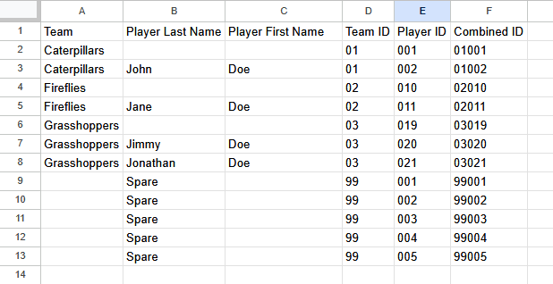
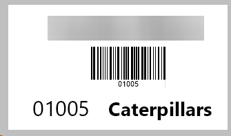
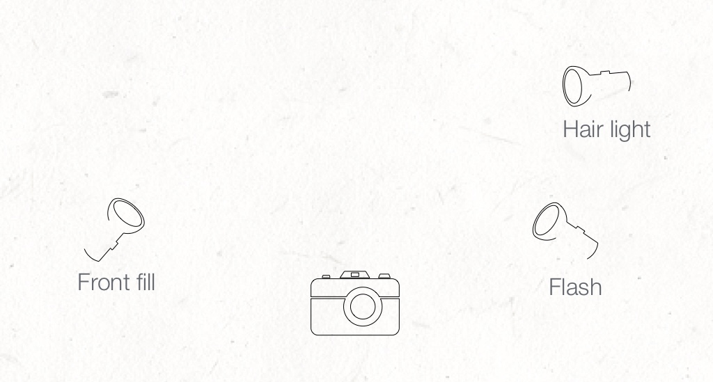
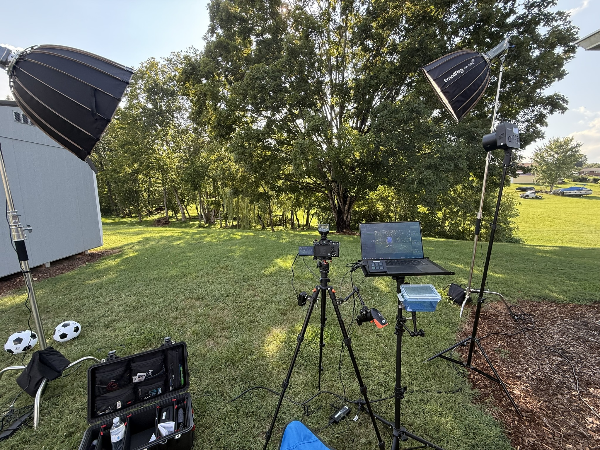
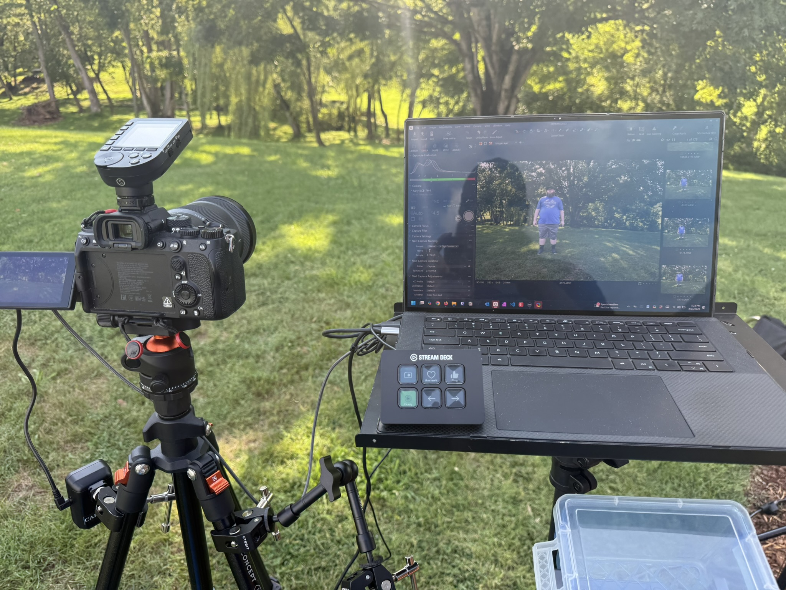
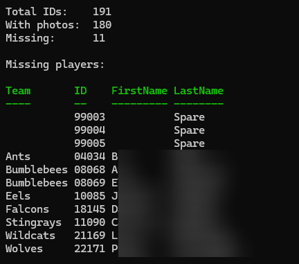

## Intro

Every year my church has a Upward Soccer league with almost 200 players ranging from 3 years old through high schoolers. I volunteer to take the player and team photos. Being able to quickly take photos and tag them with the player information is crucial as we have to get through all of them in just a few hours. 

The way this worked this year is we had 3 people getting the kids in line and finding their player card which has a unique ID, and then passing it to me as the kid had their photo taken, and then we would do a full team picture. In addition to those 3 people putting them in order I had 1-2 helpers who would pose the kid while we were getting everything else ready. This worked really well and helped us keep the line moving and get through everyone easily.

Once the photos are taken I use a lot of computer automation to process the photos, create a player card image, and rename them before they are uploaded to our gallery website for the parents to view and purchase prints.

In this post I'm going to give all the details on how we accomplished this photo session.

## Set Up

### Player IDs

As the season begins I get a player roster from the coordinator and I build a spreadsheet of these teams and players. I have a column for the team name, the player first and last name, and then some IDs.

The Team ID is a 2 digit ID just starting at 1 and each team has an ID. The player ID is just an incremented unique ID for each kid plus a few spare cards in case there were late additions. There is also a row for just the team name that I use for the team photo

The data shown here is some made up names but you get the idea. 

I then have a column concatenate these IDs and give me a 5 digit ID for each player. The reason I do this is for sorting later. I can easily sort each player into a folder based on their team number. When I publish the gallery I like to have albums for each team so the parents can find the photos easier.

### ID Cards

This year was the first year we used ID cards to be passed between the helpers and myself. Last year they had the spreadsheet I made and would give me the 5 digit ID to be manually entered into my software. This works but it was time consuming and confusing to make sure we had the numbers correct. 

Using a Dymo label printer I was able to export my spreadsheet as a csv file and import into the Dymo software. From there I made a simple design with the player name at the top, a barcode encoding the player ID, the ID larger, and the team name.

This worked really well for us. Prior to the shoots I printed all of these out and separated them into teams to make it easier for the helpers to find the team and player as we tend to shoot out of order as the kids arrive.

I printed these out on [Dymo compatible non-adhesive business cards](https://www.amazon.com/dp/B0BKG8C9KS?ref=ppx_yo2ov_dt_b_fed_asin_title) and I was super happy with how well this worked.

## The Shoots

### Lighting Setup

We shot all of the photos outdoors but in the shade. It was also in the evening and the sun was starting to set so I wanted a simple lighting setup that would make sure all of the photos were lit close to the same. I set up 2 Smallrig LED lights as my hair light and front fill and a Neewer flash off to the side of my camera.

The constant LED lights and flash made sure that everything was exposed properly and gave enough separation between my subject and background.

### Computer/Camera Setup

For the camera setup, I shot on a Sony A7IV with a Sony 24-70 f2.8 GM lens. This gave me a fantastic picture and let me zoom in closer on individual shots and still capture the full group.

From the camera I shoot tethered to my laptop (Dell XPS) into Capture One. I've tried a few different pieces of tethered shooting software and went with Capture One this year as I'm using it for my editing already so this helps me skip a step of importing into Capture One. I probably won't do this next year and will probably go back to SmartShooter 5. The reason being Capture One doesn't show a live preview whereas SmartShooter does. This makes it a bit easier to frame the shot and make sure it's good before taking the picture, instead of using the screen on the camera.

I am also using a cheap barcode scanner and an Elgato Stream Deck for a hotkey I'll explain later.

I set up my camera on a tripod and have a laptop stand beside it for my laptop and use a Neewer Magic Arm clamp to attach my barcode scanner to the stand to make the scanning easier.

### The Process

Our process for shooting these pictures is the kids can come line up whenever they arrive for practice so we can start taking individual shots quickly and be ready for team shots once everyone is here.

The kids start off by checking in with my helpers as they find the player's card and hand it to me. I scan their card and it will set the filename in Capture One as the barcode which is their 5 digit ID. While I'm doing this they go stand at a spot we have marked and another person helps pose them. Whenever they are posed and ready I take 1-3 shots per player and make sure at least one looks good and they have their eyes open.

Once this is good they will join their team again. At this point I press a button on my Stream Deck that runs an AutoHotKey script to click on the name field and erase it and be ready for me to scan the next card.

This script is one of my pain points with this setup, there is no way for Capture One or SmartShooter to erase the current ID when I scan a new one, so this button makes it easier than trying to navigate and click where the name field is.

## Editing

### Importing the Photos

The first thing I do for editing is copy the Capture One project to my storage server so it gets backed up. This satisfies my 3-2-1 backup policy. Copy 1 is my main project on my laptop. Copy 2 is the raw photos on the SD card in my camera. Copy 3 is on my NAS which gets backed up offsite to Backblaze at night. 

Once the project is copied I run a Powershell script (https://gist.github.com/joshuacarmack/5149d14791e1f0dc18d204e9cafed5b7) that takes my CSV export of all the players and their teams and IDs and compares it to the files in my project folder. The photos come out named with the 5 digit ID, a dash, and then a shutter count so every photo is unique but I can still sort them easily. The script ignores the second half of the filename and is only checking the ID. It will tell me the total IDs and how many we do not have pictures for.

This lets me give the UPWARD coordinator a quick report of kids we are missing and let them decide on a makeup day.

Once we have verified I have pictures of all of the kids it's time to edit.

### Culling the photos

For 2025 we had about 170 players and I ended up with over 650 photos to go through. I went through and chose the best shot for each plater and team, ending up with about 180 shots total. I ran my script again to verify every player had a photo after I had chosen the best shots.

From this point I did basic edits and crops to all of the photos. I then exported them all to a folder. 

### Creating the player alpha background images

