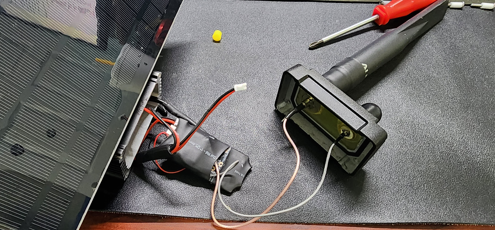
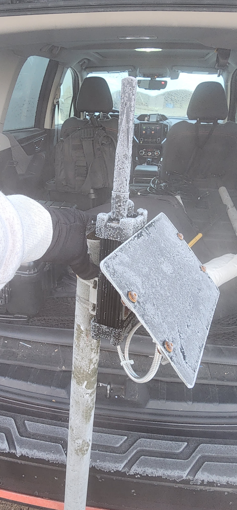
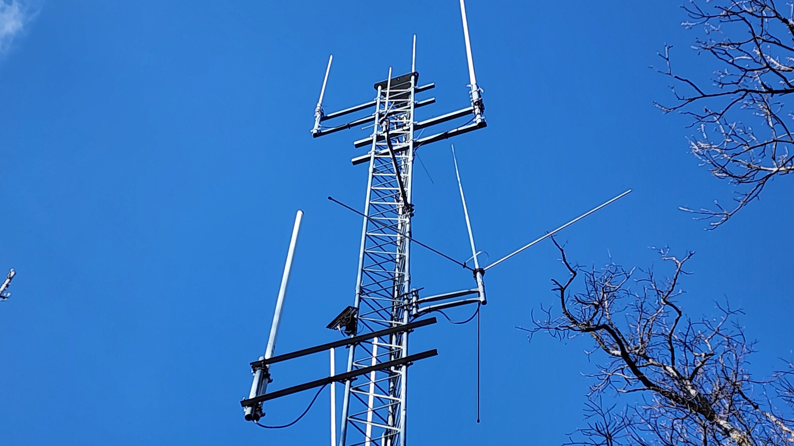
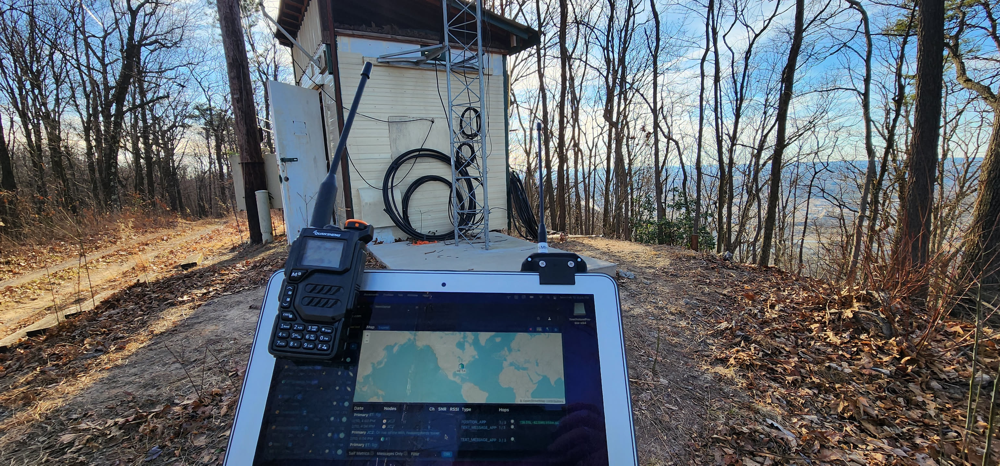

I was tasked with fixing the Meshtastic node that was installed on Kingsport Amateur Radio Club’s tower on Bays Mountain. There wasn’t a lot to fix, but in the interest of documenting it, I’m going to write it all here.

When I first got the node I didn’t know anything about it, it came in a metal case with an antenna and solar panel. I got to work and opened it up from the bottom and there wasn’t much of anything. I could see the power cable and battery pack inside. So I opened the top and found the actual node inside.

The node was blinking like it was on, but it wasn’t communicating with any of my other nodes so I found a reset button and pressed it. It took about 30 seconds and then my other node pinged saying it saw a new node and it was this one. I’m not sure what caused it, but for some reason it was hung up.

From its telemetry data, I could see the battery was still 90% charged, so it wasn’t dead or anything. It just wasn’t responding.

I learned at this time it’s a RAK4631 node. 

After some discussion with leadership I was asked to reset the node so we could have control over it. It took a while to figure this out but the RAK boards have a pretty simple reset and upgrade procedure. You connect it via a USB cable to a computer, double press the button on the node to get it into a serial mode, and then it opens on your computer like a flash drive.

To reset it, you get the firmware from Meshtastic and there is a factory reset firmware file you copy to the node. Once it reboots you do the same process again and have to open a terminal to it. But before you can do that, you have to install Meshtastic’s command line interface (CLI) software. Once that is done you can issue a command to actually reset it. Once that is done it takes a minute and then it showed up as a factory default RAK node. I did the same process and uploaded the latest firmware so it would be up to date.

After that I used [client.meshtastic.org](http://client.meshtastic.org) to connect to the node and start configuring it. I got it named and verified that it was on the mesh network and responding to messages. The next step was to configure this in router mode. A little side note that I learned while doing this is you only want a few routers in a specific area and you want to designate the best placed nodes as routers. Not following these guidelines can cause issues with the mesh network down the road. You can read more about the node configuration modes at [https://meshtastic.org/docs/configuration/radio/device/](https://meshtastic.org/docs/configuration/radio/device/). 

The next set of steps I took were to set up administration settings on the node. You can configure up to 3 admin devices that are able to control the node remotely including making changes to settings or even rebooting the device. In the latest firmware this is simple, you take the public key from each node and add it to the settings of the remote node and save it, then whoever is using those admin nodes have control over it.

That’s about all that was needed, there are still a few tweaks to power settings that will need to be made before the node gets re-deployed, but before we do that I’m testing it out. I left it inside without any solar and it only dropped a few percentages of its battery. I put it outside in the sunlight and even on an overcast day, it was still able to charge the battery. 

We decided to take the Meshtastic node to our Winter Field Day setup to test it and play around more with Meshtastic and show it off. It was a cold morning when I pulled the node down from my house, but the battery and node were perfectly healthy and didn’t mind the cold.

# Putting the node back on the mountain

The Meshtastic node on the W4TRC tower on Bay’s Mountain

Neil and Erik took the node and put it back on the tower at Bay’s Mountain and immediately we started noticing some issues. I can hear the node from my house but it won’t respond to any commands.

We let it sit for a while but nothing much changed with it. It worked fine before going up there and now that it’s on the tower it doesn’t work fully. It will send it’s telemetry every hour on the dot but it won’t pass any messages.

Neil and myself went back up a few days later to investigate. Once we got up to the tower, I tried running a traceroute to the node and even controlling it but it would not work. I could see by my Meshsense (map.tricitiesmesh.net) that my home node was receiving the portable node I had with me and was able to have 2-way communication with it but not the tower node.

My laptop with a radio and my portable Meshtastic node, looking at Meshsense from my house

We pulled the node down and connected to it via a cable to my laptop and found that the node was not receiving any messages. I tried to send a message from it and it worked just fine and was received by my home node.

At this time we figured it was something messing with the receive end on the node but we decided to put it back up on the tower, a bit lower than it was, and come up with a game plan. We now know that we need to move the node further away from the tower and are looking at some other options.

To be continued…