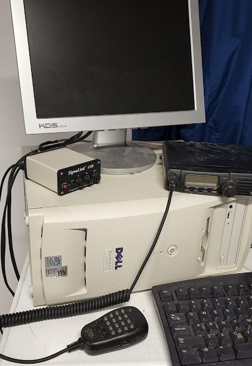
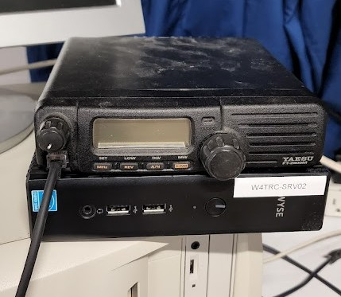
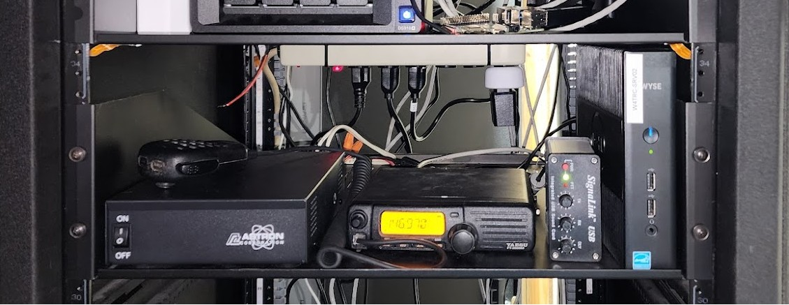
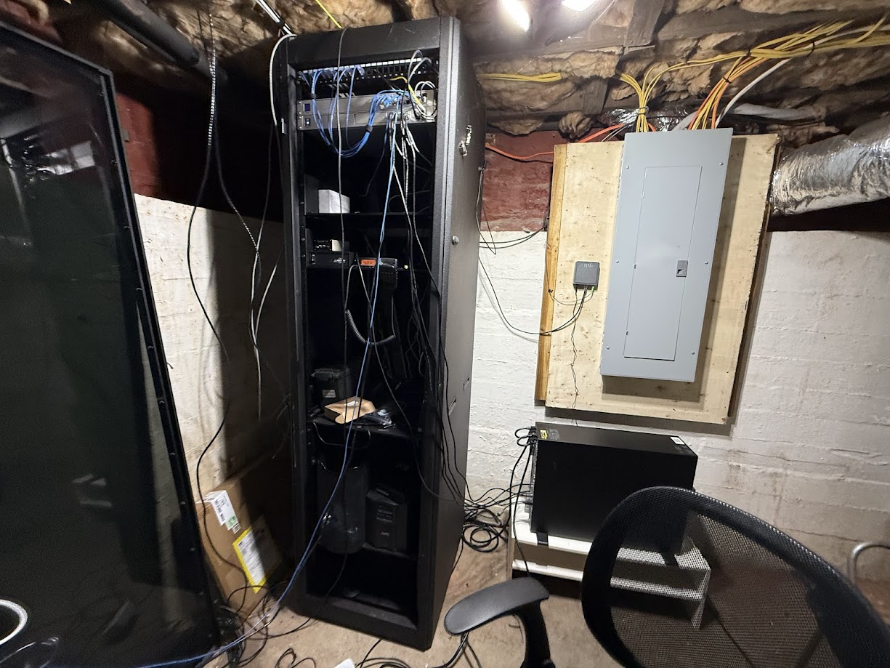

I run a system called EchoLink that allows any amateur radio operator to connect to our repeater on Bays Mountain.

# What is EchoLink?

[EchoLink](https://echolink.org/) allows licensed amateur radio operators to connect to radios, repeaters, and conferences over the internet. Using your phone or a computer program, you can simply select any station that is online and connect to it and talk on that connection. Some of the stations are online only and some connect to repeaters like ours.

For Kingsport Amateur Radio Club, if you search W4TRC/R you will find our repeater link. If you connect to this in EchoLink you are connecting to a radio in my basement which is programmed to transmit to our repeater on Bays Mountain. This allows you to be anywhere in the world, connect to our repeater, and talk with anyone over radio in the Tri-Cities area.

# Why EchoLink?

Much of amateur radio is about emergency communications, which this is not an emergency communications method, it's just a nice thing to have. This system is reliant on the internet connection and power staying online at my house, so in a storm there is a chance it may not work.

But why do we run this? It's to allow people out of range of our repeater to use it to check into our nets or talk to their friends. We run a [Sunday Night Net](https://w4trc.org/nets) to pass traffic, have discussions, receive help, and sell items. This allows people to continue to check in and participate if they are not near a radio or out of the range of our repeater.

# Why my house?

I volunteered to run the EchoLink system because I love dealing with networks and servers and also radios, so this was a good match. I also live right in downtown Kingsport below our tower so I can run the radio on a low power and still hit the repeater just fine.

# The Setup

The EchoLink station got handed to me as a Windows XP computer, radio, and power supply.

I immediately replaced it with a small form factor PC running Windows 10. 

It ran like this for a year or so at my parents house until I moved. When I moved it stayed on the SFF PC for a bit until I got my new server in place.

When I got my new server in place, I decided to virtualize the actual EchoLink server.

The SFF PC was retired and I set up a Windows 11 virtual machine on my main server running Proxmox. 

# The Setup on Proxmox

I run Proxmox for my homelab and also some production servers so it was a no brainer for me to set up EchoLink on. Proxmox runs as the operating system on the physical server but lets you run many virtual servers on it. 