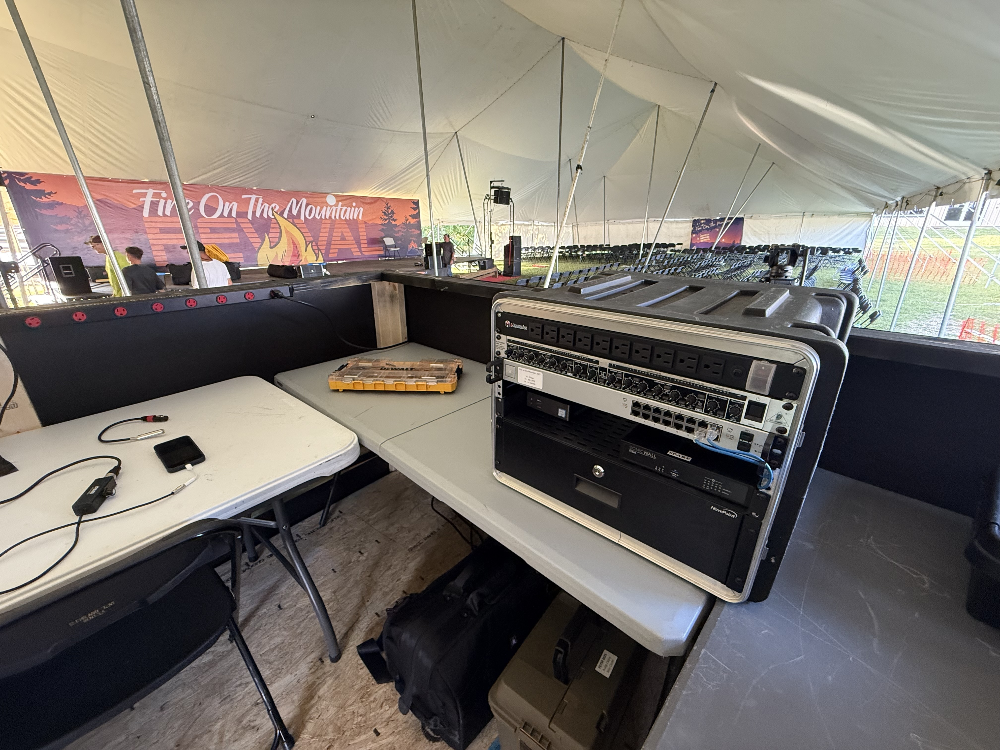
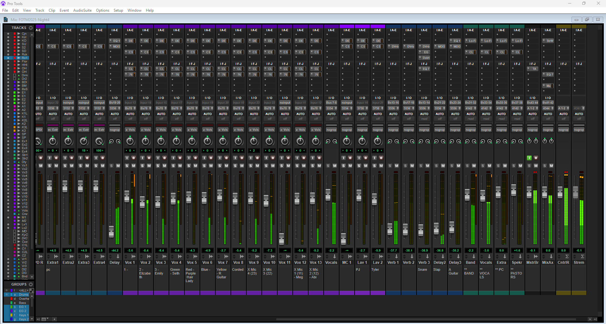
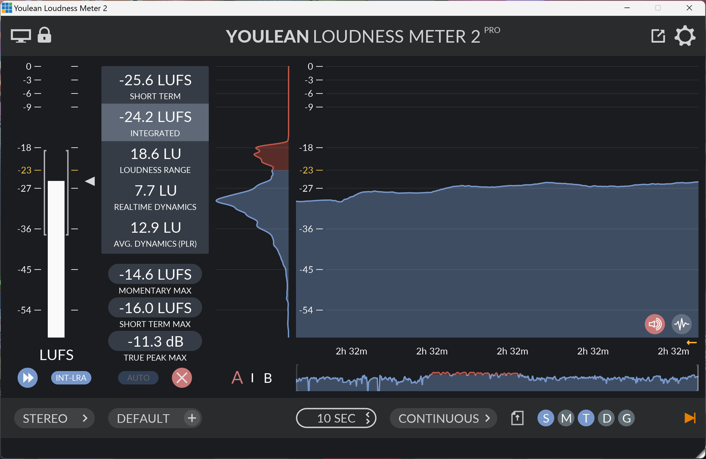
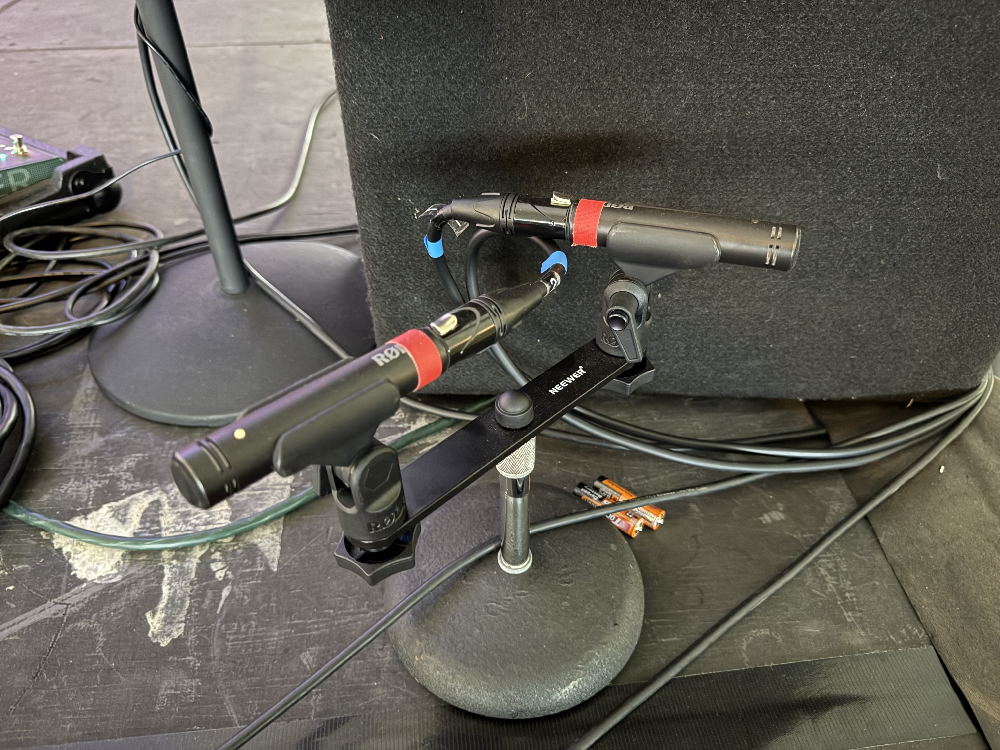
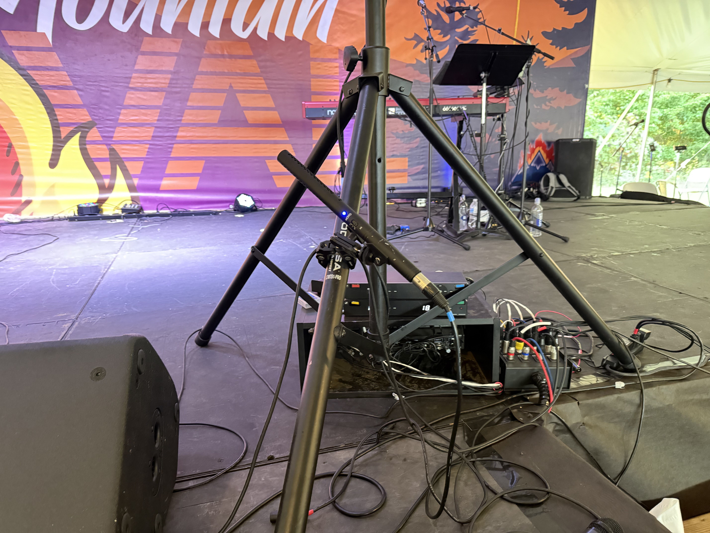
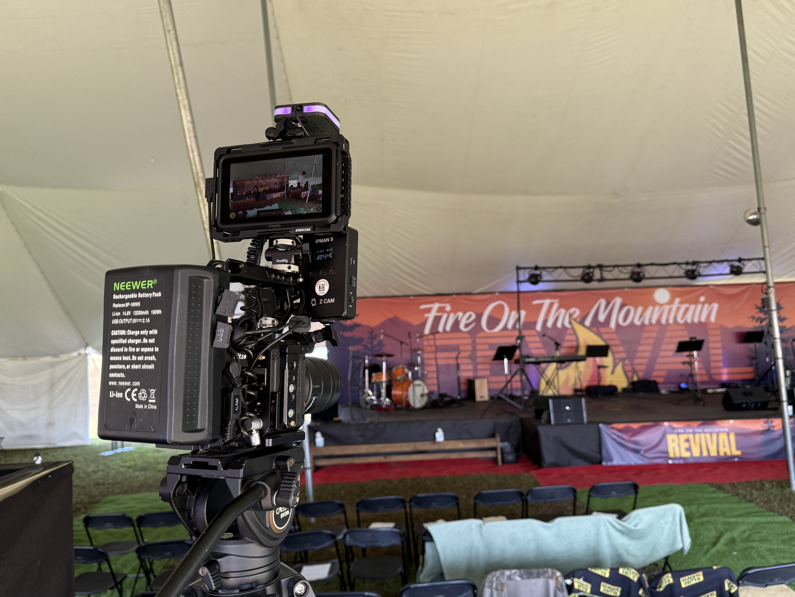
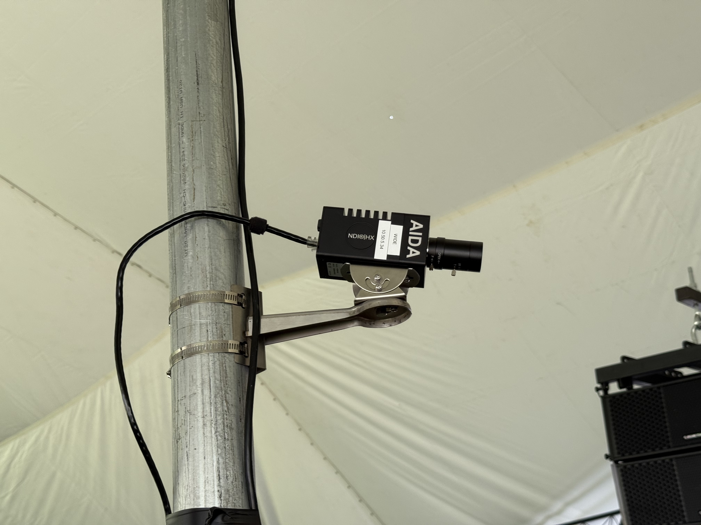
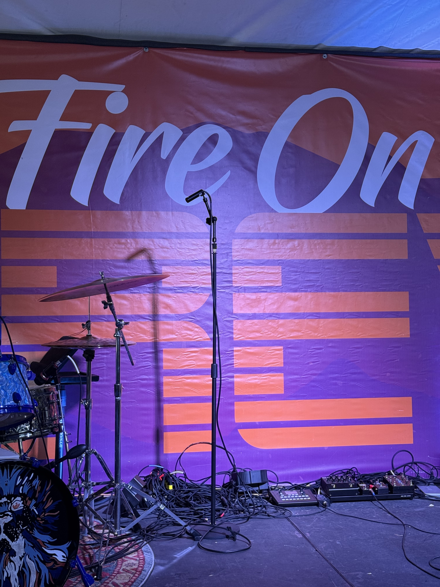
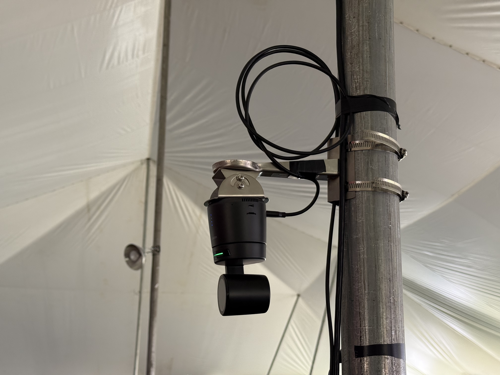
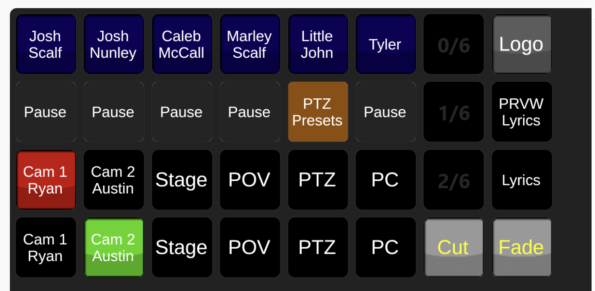

Every year my wife Meg and I go down to Grundy County, Tennessee with [Recovery Soldiers Ministries](https://recoverysoldiersministries.org/) to their Fire on the Mountain tent revival. Meg is on their worship team, and I help out with their tech team at times. During Fire on the Mountain, I’m in charge of providing the live stream. I’ve done this for the past three years, and this year was the smoothest and quickest setup we’ve had. I wanted to document it and share some tips and tricks I’ve learned along the way.

## Control Area

In the past, we worked out of a small food truck trailer, which functioned but was cramped with me, the audio mixer, and the lyrics operator all squeezed in. This year, they built us a front-of-house (FOH) platform, which was a huge improvement. There was room to walk around without constantly bumping into each other.

> **Note:** *FOH (Front-of-House)* is the position in the audience area where audio/video operators work.

## Networking

The backbone of the whole setup is the network that I bring in. Almost everything in my streaming setup is network-based, so a properly configured network is key.

The internet connection is provided by Ben Lomand Connect. They drop a fiber ONT (optical network terminal) and a wireless router under our stage. They provide free Wi-Fi for attendees but also allow us to plug into their router for a hardwired connection for our production equipment. 

Here’s the network diagram, followed by more details about how and why I set it up this way:


flowchart LR
    ISP[Ben Lomand Connect Router]
    ISP --> SS[Stage Switch]
    SS --|Untag 1, Tag 99|--> FOH[FOH Switch]
    FOH --|U1|--> SW[Firewall]
    FOH --|U99|--> SW
    FOH --> Mini[Mini FOH Switch]
    Mini --> iMac[Presentation iMac]

    FOH --> AP((Access Point))

    POV([POV Camera]) --> SS
    S1([Static Stage Camera]) --> SS
    PTZ([PTZ Camera]) --> SS
    WLS1([Wireless Cam 1]) -.-> AP
    WLS2([Wireless Cam 2]) -.-> AP


> **Note:** *VLANs* (virtual LANs) let multiple separate networks travel over the same physical cable.

### Stage Switch

The first part of the production network is the stage switch located under the stage. Our ISP connects into this switch and rides a WAN VLAN back to Front of House (FOH). The main reason for this is so I only have to run one cable between the stage and FOH, where the rest of the equipment is. This switch also connects to a few cameras. All of our cameras are networked and PoE-powered, which keeps cabling clean and allows for faster setup and teardown.

> **Note:** *PoE (Power over Ethernet)* lets network cables carry both data and power to devices like cameras—one cable instead of two.

### FOH Switch

The stage switch uplinks into the FOH switch, which sits in a rack next to the streaming position. The WAN VLAN terminates here and goes into our firewall.

### Firewall

I set up an old SonicWALL firewall for our production network. This gave me my own DHCP scope and let me pre-assign static IPs to cameras and devices. That way, I could prep and program everything at home and be confident it would just work on site. 

> **Tip:** Using a separate firewall/DHCP isolates production gear from public Wi-Fi, avoids address conflicts, and keeps settings consistent across years.

### Access Point

This year I ran a single UniFi UK-Ultra AP at FOH. This supported devices like my phone and tablet and also connected our two wireless cameras, which are networked.

## Audio – Main Stream Feed

In past years, we kept things simple: taking an AUX feed from the FOH console and relying on the main sound engineer to adjust levels for the stream.

This year, I decided to mix the stream audio myself. The FOH console is an Allen & Heath QU-32, which lets me connect a computer via USB and get multitrack audio. I ran this into a second laptop running Pro Tools with [Luke Hendrickson’s broadcast template](https://productiononline.com/luke-hendricksons-broadcast-template/).

> **Note:** *Why multitrack?* You can balance vocals, instruments, and speech separately for the online audience instead of inheriting the room mix, which is tuned for loudspeakers under the tent.

Luke’s template is fantastic. It provides a solid base mix with plugins for EQ, compression, and effects. Mixing independently from the in-person mix let me deliver a clear, high-quality sound on the live stream.

From the Pro Tools PC, I routed a single mono channel back to the mixer and out through an AUX feed into a PreSonus Studio 26c 2x4 USB audio interface, then into my streaming PC running vMix.


flowchart LR
    QU[A&H QU-32 Mixer]
    ML[Mixing Laptop - Pro Tools]
    PS[PreSonus Studio 26x Interface]
    SL[Streaming Laptop - vMix]
    
    QU --|USB - 32 channels|--> ML
    ML --|USB - 1 channel|--> QU
    QU --|XLR - 1 channel|--> PS
    PS --|USB|--> SL


Once the audio hit vMix, I used a plugin called Youlean Loudness Meter. It records the loudness over the length of the stream and provides a visual target, ensuring consistent levels and clear audio.

> **Tip:** I used the default -23 LUFS target range, which kept the stream consistent without clipping.

### Audio – Crowd/Stage Mics

In addition to the multitrack audio, I ran a Behringer X-Air 12 mixer just for crowd and stage mics. Our audio engineer let me borrow four channels on his audio snake from stage to FOH, which I patched into my X-Air.

I set up two condenser microphones on the stage corners to capture the crowd singing and general room tone. 

I also added a shotgun microphone pointed at the stage. They often do skits or have choirs sing without mics, so this helped avoid dead silence on stream.

The mic placement wasn’t ideal, but I kept it hidden and out of the way. It did the job.

## Streaming PC

The streaming PC was a Dell XPS 15 9250 (i7-12700H, 32GB RAM, 1TB SSD, RTX 3050 laptop GPU) running vMix. vMix handled all of our camera inputs, graphics, lower thirds, audio, and this year, our projector outputs.

### ME2 – Projection

Due to issues with the iMac and HDMI adapters, I ran the projector output through a second mix engine (ME) in vMix. This let us click a button and switch the projector between the iMac screen or the live stream output, showing cameras on the tent screens when needed.

> **Note:** *ME (Mix Engine)* in vMix is like a second mini-switcher. It lets you drive a separate output (e.g., projectors) independently from the main live stream.

## Cameras

We used a mix of my cameras, RSM’s camera, and one borrowed from my church. The primary cameras were the two wireless ones, with a stationary and a PTZ camera providing extra angles.

### Wireless Cameras

Our best cameras were two identical Z CAM E2s with Olympus M.Zuiko 40–150mm (F4.0–5.6) lenses and Z CAM IPMAN transmitters. With Micro Four Thirds sensors, they perform well in low light. Being fully battery-powered and wireless gave us excellent flexibility anywhere under the tent.  

Due to headset and tripod issues, we only ran one as a mobile camera. The other was stationed on a platform in the back center of the tent.  

The stationary camera operator relied on a tally light and some general shot guidelines. The mobile operator and I had a headset for direction.  

RSM likes to capture personal moments—worship, prayer—and having two manned cameras let us highlight those, helping viewers feel like they were truly under the tent.

### Stationary Cameras

Our stationary cameras are AIDA Imaging POV box cameras. I only set one up due to time constraints, but it worked well enough that I didn’t add more later. These cameras have small sensors but are great for wide angles, so we placed one slightly off-center on stage.  

### Point-of-View Camera

In addition to the wide stationary camera, I used an AIDA POV camera mounted on a microphone stand on the stage for a POV shot. This was mainly used as a drum cam to provide some unique angles and fill-in shots.

### PTZ Camera

My new toy this year was an OBSBOT Tail Air camera—a small 4K PTZ webcam with an optional NDI adapter. I mounted it on a pole near center stage, about 10–12 feet from the pastor.

> **Note:** *PTZ* stands for *pan-tilt-zoom*.  
> **Note:** *NDI* is a video-over-IP protocol that sends high-quality video across standard networks.

This turned out to be my favorite. Despite only having a 4× digital zoom, it provided clear stage, altar, and tent-wide shots. Its AI tracking performed much better than expected, though we mainly relied on the manned camera for follow shots.

## vMix Setup

Inside vMix, every input came in separately. This let me make color adjustments and ensure each shot looked its best.  

This was the main interface for our live stream. From it, I could see all of our cameras and other video inputs including images from the presentation computer, lower thirds, lyrics, and logos. I could preview the inputs and switch to them live. The left box is what I was looking at currently and the red box on the right is the output feed, which is what the stream viewers were seeing.

## Controls

To control it all, I used two Elgato Stream Decks — a 32-key as the main switcher and a 6-key for the second ME. This gave us quick projector output switches. Both Stream Decks were driven by [Bitfocus Companion](https://bitfocus.io/companion), one of my favorite pieces of software for live production. Companion lets you design the buttons that appear on the Stream Decks and assign their actions. It supports connections for over 650 different pieces of software and hardware used in live production. In my setup, I only used two: the vMix connection and the Obsbot connection for controlling the PTZ camera.

This screenshot shows the 32-key Stream Deck, which served as my main switcher.  
- **Bottom row:** select an input to preview  
- **Row above:** shows the input that is live  
- **Next row up:** pause any unused cameras so they don’t appear in preview, reducing processing load  
- **Top row:** lower thirds for nameplates — pressing a button displayed that person’s name on screen  

The right side had additional controls for cutting or fading the selected input live, and toggling our lyrics lower third.

## Proxmox Server

One piece of gear in my rack was a mini-PC running Proxmox. It hosted my UniFi controller (for the switches and AP) and a Zabbix proxy for monitoring. See my blog post on [my monitoring setup](/post/monitorallthethings/).

This let me keep an eye on the cameras and quickly spot if anything went down during the event.

## Final Review

Overall, this was the best setup we’ve ever had.  

On night four, I got sick and had to stay at the hotel. Thankfully, Meg took my laptops to Nick. I FaceTimed him to walk through the setup, and he was able to run the stream while I assisted remotely with some audio tweaks.  

This is one reason I love being computer- and network-based. It can be more complicated (software quirks, overheating laptops), but the flexibility and ease of setup are worth it.  

### What I’d Change Next Year

#### 10-gig networking (or at least 2.5-gig)

I’d like a 10-gig switch at FOH, with all cameras connecting there. Even though the cameras are only gigabit, having a 10Gb uplink to my computer would handle aggregate traffic better.

> **Note:** Think of this like adding more lanes to a highway. Each car (camera) still drives at the same speed, but the wider road prevents traffic jams at the merge to the computer.

#### Better streaming PC

I maxed out the GPU on my laptop this year. With 17 inputs in vMix, it was at its limit, and I saw glitches (mainly frame drops) even when pausing unused inputs.

#### External projection switch

I’ll likely add a simple HDMI switch for the projector. That way, we can toggle between the presentation computer and stream output using dedicated hardware, offloading that task from vMix.

> **Why:** Hardware switching reduces GPU load, eliminates “app crashed = projector black” scenarios, and makes it easier for a volunteer to operate.

---

## Video Switching Timelapse



## Gear List

Here’s a quick reference list of the main gear used this year:

- **Network**
  - Ben Lomand fiber ONT + router
  - SonicWALL firewall
  - UniFi UK-Ultra Access Point
  - UniFi USW-24-PoE (FOH Switch)
  - UniFi USW-Lite-16-PoE (Stage Switch)

- **Audio**
  - Allen & Heath QU-32 console
  - Laptop running Pro Tools + Luke Hendrickson broadcast template
  - PreSonus Studio 26c 2x4 USB interface
  - Behringer X-Air 12 (crowd/stage mics)
  - Rode M5 small-diaphragm condenser mics (2)
  - Movo X3-II 11-inch shotgun mic (stage)

- **Video**
  - Dell XPS 15 9250 (i7-12700H, 32GB RAM, RTX 3050) running vMix
  - Z CAM E2 (x2) with Olympus M.Zuiko 40–150mm lenses + IPMAN transmitters
  - AIDA Imaging HD-NDI-200 box camera
  - AIDA Imaging HD-NDI-MINI POV camera
  - OBSBOT Tail Air PTZ camera (with NDI adapter)

- **Control**
  - Elgato StreamDeck 32-key
  - Elgato StreamDeck 6-key

- **Infrastructure**
  - Mini-PC running Proxmox (UniFi Controller + Zabbix proxy)

---
