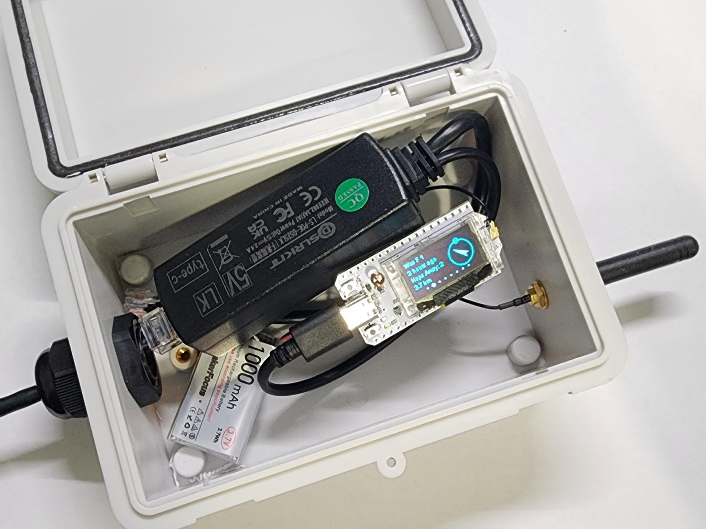
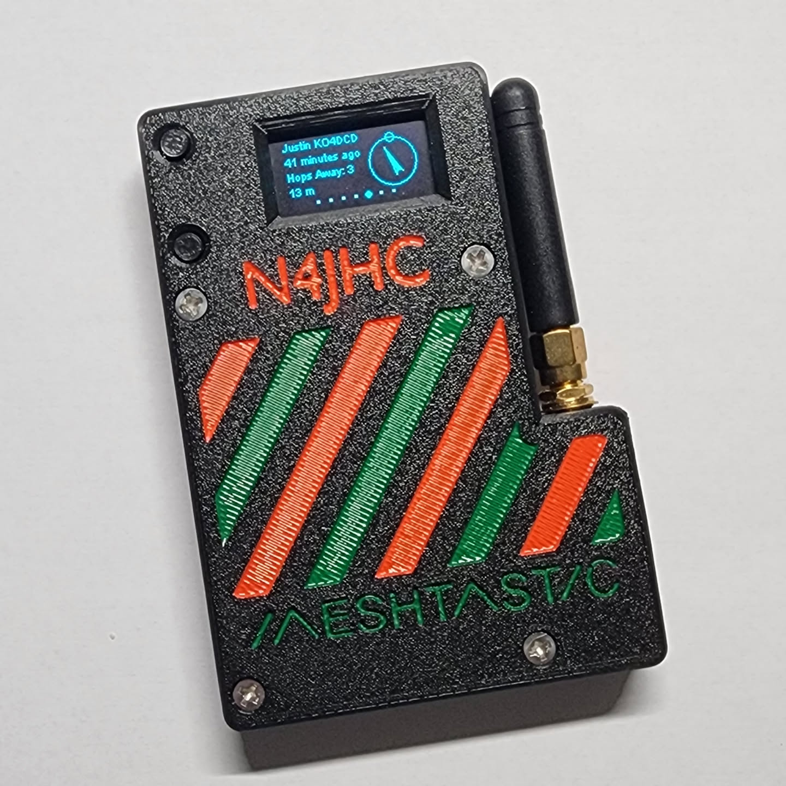
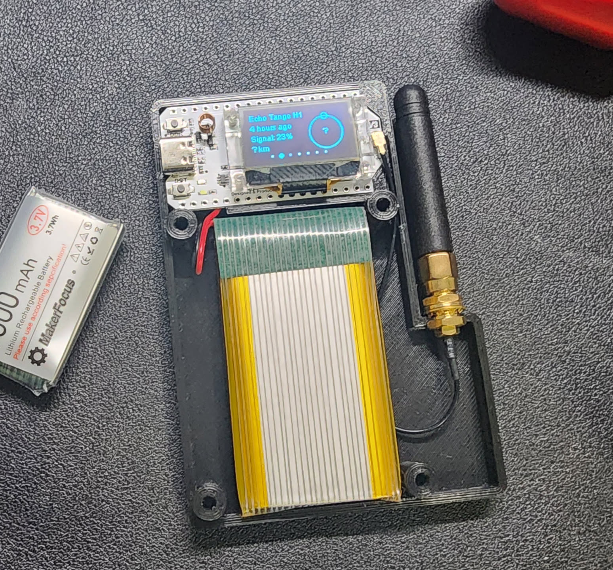
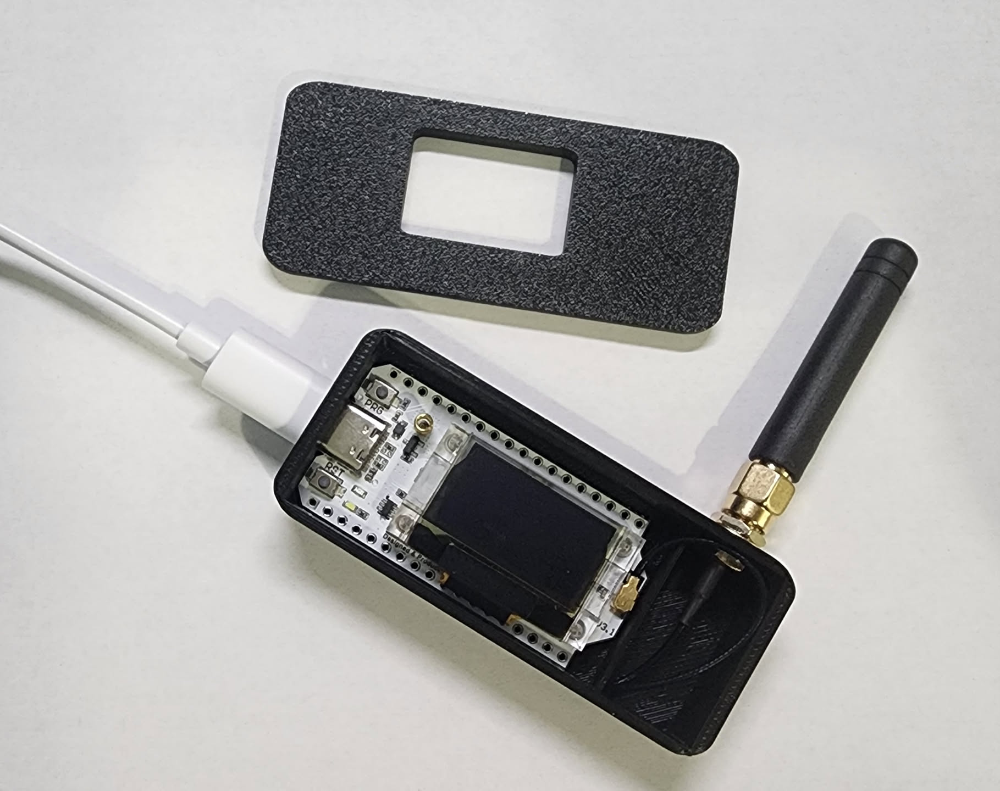
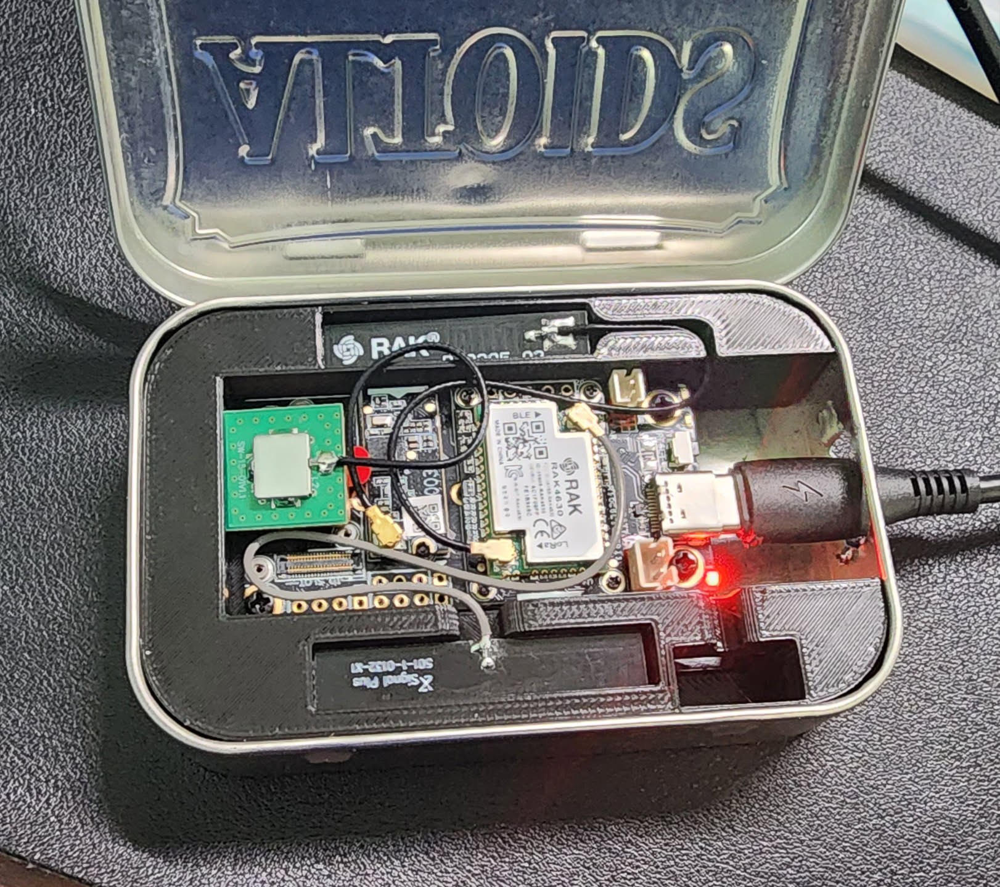
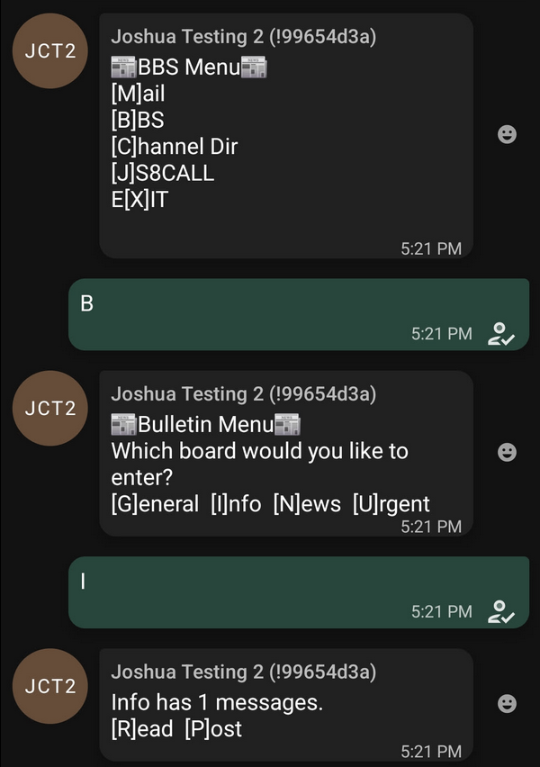
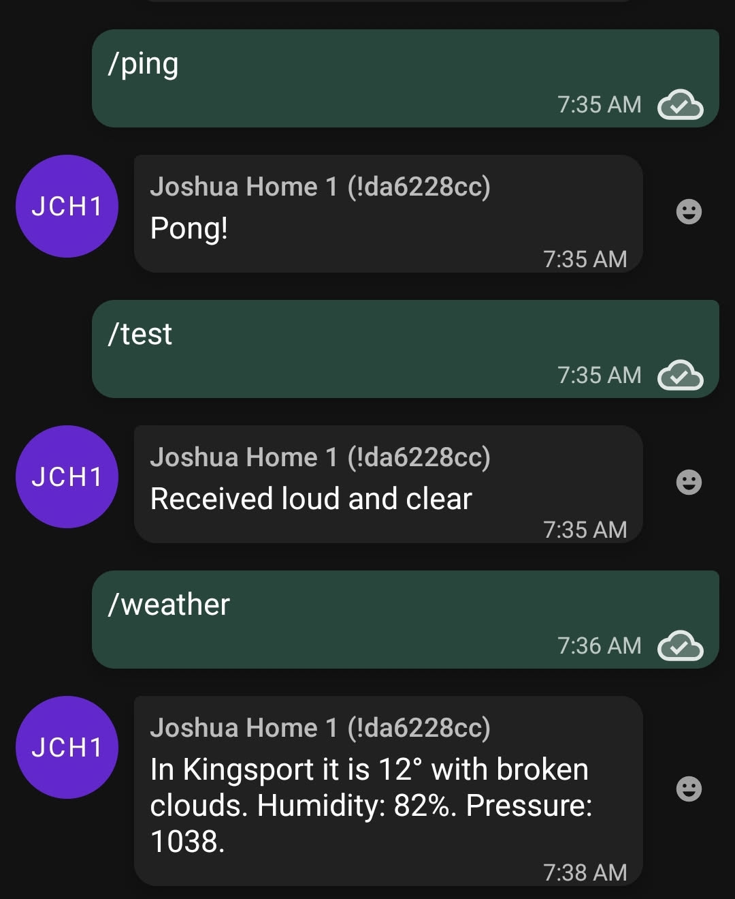

# Learning Meshtastic Messaging

Tags: Ham Radio, MQTT, Meshtastic, Servers
Published: January 21, 2025
Author: Joshua Carmack

---

# What is Meshtastic?

Meshtastic is a decentralized off-grid communications system that lets you send and receive short messages using low-powered and cheap devices. This is built on the LoRa protocol, which stands for Long Range. Anyone can buy a Meshtastic device (called a node) and mesh with other users. The more people that have Meshtastic nodes spread around, the stronger and further the mesh will reach. 

Devices only cost about $30, so they are cheap enough to have multiple to give to friends or family members and have reliable communications. 

# My Setup

## Equipment

### Home Node (Joshua Home 1)

This is my primary node that is at my house. At the time of writing this, it’s inside in a window but soon will be moved and mounted on my roof. 



The node itself is a Heltec V3 ([https://www.amazon.com/gp/product/B0CW62KK5N?ie=UTF8&psc=1](https://www.amazon.com/gp/product/B0CW62KK5N?ie=UTF8&psc=1)) with a small 1,000mAh battery and a power-over-ethernet (PoE) splitter to get power from inside easily, all in a waterproof enclosure. This node also is connected to my Wi-Fi and provides data from the mesh to my servers for collection and analysis. More about that later.

I’ll probably be swapping this node out for something better soon, as this was the first one I put together. 

### Portable Node (Joshua Portable 1)

This is the node I use the most. It’s another Heltec V3 with a 3,000mAh battery in a 3D printed case. 





### Test Node

This is another Heltec V3, but without a battery. It is in a small 3D printed case. I’m using it for testing purposes at the moment.



### Bulletin Board Node (Joshua Test 2)

This node is my experimental node and is currently running TC2-BBS-mesh. 

The node is a RAKwireless WisBlock Meshtastic Starter Kit ([https://www.amazon.com/dp/B0CHKZJK9C](https://www.amazon.com/dp/B0CHKZJK9C)) connected to a Raspberry Pi 3B running Debian 12.


RAK Node connected to Raspberry Pi for testing



RAK Node in an Altoids tin with a 3D printed insert

## BBS-mesh

BBS-mesh is a program written by TheCommsChannel ([https://github.com/TheCommsChannel/TC2-BBS-mesh](https://github.com/TheCommsChannel/TC2-BBS-mesh)) which runs on a computer (in my case a Raspberry Pi) that connects via serial to a Meshtastic node (my RAK board). Once this is set up it operates like an old school bulletin board system. To begin you can send a message to my test node with any text and it will give back the options you have for using the BBS. With it, you can read and post on the bulletin boards or send messages to other users. There are also a few utilites you can access which will give information about the mesh.




The BBS system is not connected to the internet in any way, so as long as the node and Raspberry Pi have power, this is still able to function. 

## Monitoring

I’m a big fan of monitoring and data/metrics gathering so the first question I asked about Meshtastic was “What data can I gather?”. One of the neat things about this being a mesh system is that it is very simple to receive and gather data from everywhere from just one node.

### Meshsense

Meshsense by N3FJP/Affirmatech ([https://affirmatech.com/meshsense](https://affirmatech.com/meshsense)) is a small program you can run that connects to a node and shows you all the other nodes and messages it is receiving. This was a life saver as I was starting to get into Meshtastic. Being able to easily see other nodes and messages helped so much. The software even has the ability to make a public dashboard of what your node sees. You can view mine at [https://meshtastic.n4jhc.com/](https://meshtastic.n4jhc.com/). This will show you any nodes near Kingsport, TN and the status of them. 

### MQTT

Meshtastic uses MQTT under the hood for communication. MQTT is a simple protocol that just sends JSON objects and messages around. You can set up an MQTT Broker that is like a central communicator that can send and receive MQTT messages. 

I run Eclipse Mosquitto as my MQTT broker. This lets me connect my home node to the MQTT broker and that sends any message my home node receives to the broker to be read by other software.

An MQTT message looks like this (identifying info redacted):

```json
{
  "channel": 0,
  "from": ********,
  "hop_start": 5,
  "hops_away": 0,
  "id": ******,
  "payload": {
    "altitude": 380,
    "latitude_i": 365******,
    "longitude_i": -825******,
    "time": 1737497800
  },
  "sender": "!da******",
  "timestamp": 1737497799,
  "to": ********,
  "type": "position"
}
```

This is a standard position report that Meshtastic sends out at regular intervals. With this update anyone else in the range of the mesh can know what nodes are out there and where they are. A few components of this message is the from which says what node this message is from. You can also see the hops_away which would tell us if we are directly talking to that node or if it’s being routed through the mesh. We also have the payload which can be any kind of information. The type at the bottom tells us this a position report so the node knows what kind of data will be in the payload. 

There is also telemetry reports that are sent out from most nodes. It has the same structure as a position report but the payload is different. Most nodes can beacon out their battery information and a few other reports. This was very interesting to me. 

```json
{
  "channel": 0,
  "from": ******,
  "hop_start": 3,
  "hops_away": 0,
  "id": ********,
  "payload": {
    "air_util_tx": 1.38163888454437,
    "battery_level": 101,
    "channel_utilization": 4.6966667175293,
    "uptime_seconds": 1299788,
    "voltage": 4.81599998474121
  },
  "rssi": -121,
  "sender": "!da******",
  "snr": -18,
  "timestamp": 1737497719,
  "to": ********,
  "type": "telemetry"
}
```

With this, we can begin to make this data make sense. My first attempt was using Home Assistant which I use for some automations but it is good at looking at data. From this I was able to have it only look at the “from” field of nodes I wanted to monitor and pull their payload data and show it easily. This was very helpful for when we were testing the node that will go on Bays Mountain.


### InfluxDB and Grafana

After I realized I was able to pull data from these, I wanted a way to store that data. InfluxDB is a time series data platform that is used to store anything that has a time record attached to it such as sensors or temperatures, or even Meshtastic data. MQTT works for viewing these messages but it doesn’t store them, so we needed something to store them and that’s where InfluxDB falls into place.

This is where Meshflux by lameslime ([https://github.com/lameslime/meshflux](https://github.com/lameslime/meshflux)) comes into play. This is a simple program that polls my home node and takes any statistics it finds and puts into InfluxDB for storage. 

With the data being in InfluxDB now, we can use Grafana to search and view this data. Grafana is a great tool that makes pretty graphs and views from tons of different data sources. So I can add an InfluxDB connector in Grafana and query any of the data from the mesh.

One of the things I wanted to track was battery levels for my nodes and the node we will be putting on top of a mountain. With Grafana this is a few simple clicks to get a graph and configure alerts.


With this being a mesh system, I can also see all battery levels across the entire mesh.


You can view this realtime dashboard at [https://grafana.jclab.xyz/public-dashboards/3df238fa1c1d4d50a88b95ec050ebe88?orgId=1&from=now-24h&to=now](https://grafana.jclab.xyz/public-dashboards/3df238fa1c1d4d50a88b95ec050ebe88?orgId=1&from=now-24h&to=now).

### Node-Red

Now that I have reliable data coming in and being stored, I wanted to learn how to get messages back into the mesh system with MQTT and this is where Node-Red falls into place. Now I admit there is probably a better way of doing this without so many different pieces, but I’m just learning and using tools I already know and use. 

Node-Red is a flow based automation software that can take all kinds of inputs and do processing and output some kind of data. One of those things it can use is MQTT. 

So I set up a jctest channel between my nodes on Meshtastic and was able to pull it into Node-Red via MQTT. I simply set up an input listening to that channel and taking in any message it hears.


From there, that is wired up to a switch node and it simply checks the message it received and listens for my pre-set commands of “/ping”, “/test”, and “/weather”. 


If it received the “/ping” or “/test” message it just outputs a response. And this is a simple JSON payload that responds from my node and sends back a message. 


If it receives the “/weather” message it does a bit more processing. 


The first node uses OpenWeatherMap to look up the weather for Kingsport. This returns a JSON object that we can pull pieces from.


The next node is a Unit converter which takes the tempc and converts it to Fahrenheit.  The next node formats the message into a JSON message to go back into MQTT.


This is a template node that can take multiple pieces of the message it received (the payload) and make it into another message. So we are taking pieces of the weather report and building it into a message.


The last part is to send this message back to MQTT. This was a bit tricky and took some time to figure out. On my home node that I’m pulling data from, I have to have a channel on Meshtastic called mqtt. Node-Red sends it’s message to the mqtt topic which will let it broadcast to any channel.

Now this lets me use my test channel to run commands and get responses back.



The next steps are to be able to let anyone message that node and get a response sent back to them. We can also use this for sending pre-programmed messages or telemetry across the mesh.