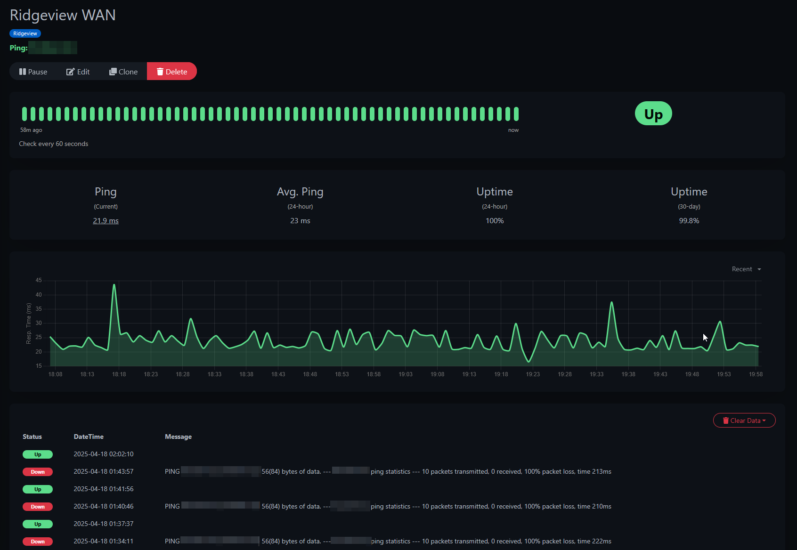
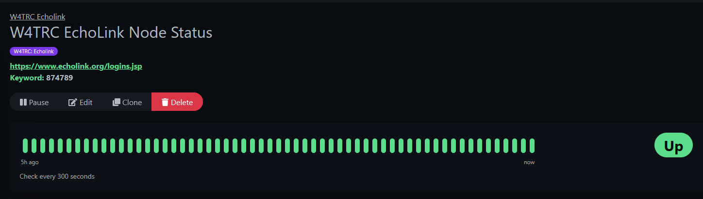
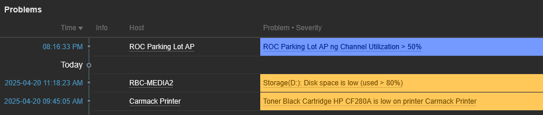
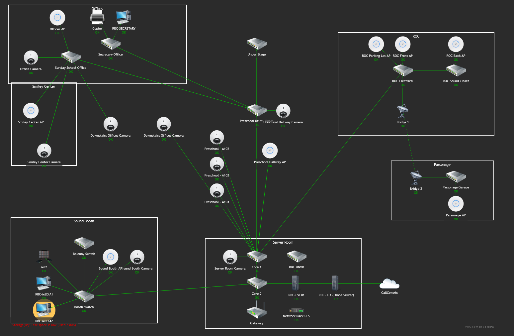
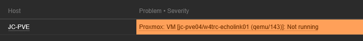
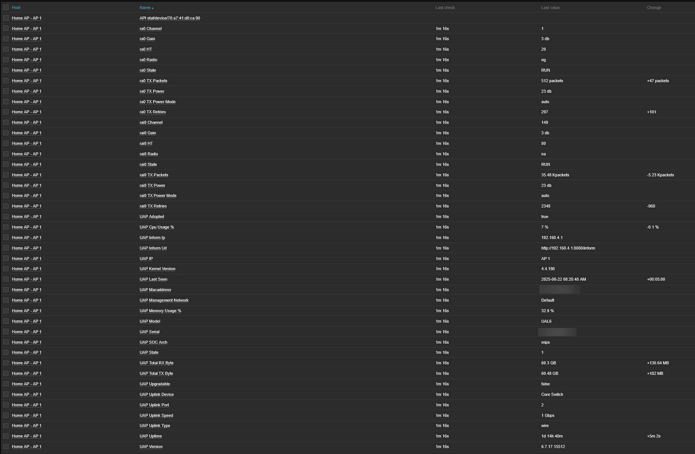
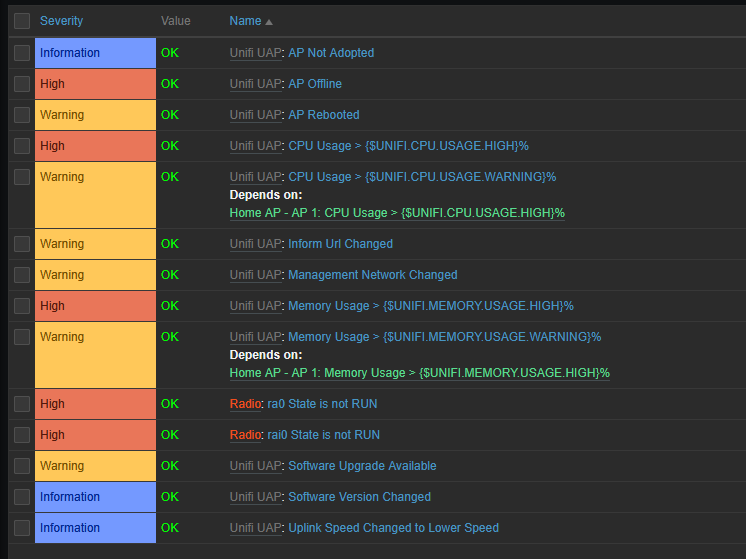

## My Monitoring Systems Overview

One of my favorite ongoing projects, first in my homelab and now in production, is monitoring. Once I started self-hosting applications and websites, I knew I needed to make sure they were always available. That began my journey into the world of monitoring systems.  

It might sound boring—just checking if something is working—but to me it’s a game: how much data can I pull and visualize? I monitor everything from website uptime and network utilization to battery and power status, and even copier toner. The appeal is simple: the data is out there, and I can use it.

## How It Began: Uptime Kuma

The very first monitoring system I set up was [Uptime Kuma](https://github.com/louislam/uptime-kuma). It’s a simple web app for basic checks like HTTP, ping/ICMP, TCP ports, and keyword monitoring.

I use it to confirm a site’s availability or to check a location’s internet connection. Below is an example monitor that pings my church’s WAN IP every minute. It provides a graph of response times and a history of status changes.

When the WAN goes down, I get an alert on my phone:

Uptime Kuma supports alerts to many platforms including email, Discord, and push services. I use [Pushover](https://pushover.net/), a simple one-time purchase, for push notifications.

It can also check a site for specific words or phrases to ensure they’re present, or check open ports.  

For example, my radio club uses **EchoLink**, which exposes a status page listing active connections. I set up a keyword monitor in Uptime Kuma that looks for our node number. If the number isn’t on the page, I get an alert that our node disconnected.  

## Migration to Zabbix

After a while, I realized I needed more. While Uptime Kuma is great, it has limitations. The biggest missing piece was monitoring inside my home and church networks while keeping the main system cloud-hosted for resilience.

I tried a few suites but landed on **Zabbix**. It’s free, powerful, and expandable.  

The killer feature for me was its distributed model. My primary Zabbix server runs on a VPS in Linode’s Atlanta datacenter. I also run Zabbix proxies at home and at church. These small VMs handle all monitoring locally and forward results back to the main server.


graph TD
    ZabbixServer[Zabbix Server - Cloud]
    HomeProxy[Zabbix Proxy - Home]
    ChurchProxy[Zabbix Proxy - Church]

    ZabbixServer --> HomeProxy
    ZabbixServer --> ChurchProxy

    subgraph Home_Network
        HomeProxy --> HomePC1[PC 1]
        HomeProxy --> HomePC2[PC 2]
        HomeProxy --> HomeSwitch[Network Switch]
    end

    subgraph Church_Network
        ChurchProxy --> ChurchPC1[PC 1]
        ChurchProxy --> ChurchPC2[PC 2]
        ChurchProxy --> ChurchRouter[Router]
    end


Each proxy receives data from devices on its network, then securely forwards it to the cloud server. Proxies also perform active checks on devices like printers, switches, and UPS units that don’t run agents.  

At church, all PCs run the Zabbix agent, reporting uptime, reboots, CPU, memory, and disk usage. This lets me keep a close watch on performance and capacity.  

The Zabbix dashboard shows triggered alerts at a glance. Below: an access point at church hitting high utilization, plus warnings for disk space and low toner.  

Zabbix can also map entire networks. Here’s Ridgeview’s layout—switches, APs, cameras, and major systems—highlighting a disk alert on the MEDIA2 PC.  

*Note: I host the Zabbix server in the cloud so monitoring continues even if my home or church connections go down. Local proxies keep gathering data until they reconnect.*

## What I Monitor in Zabbix

### Homelab

Zabbix monitors my Proxmox cluster. It auto-discovers new VMs and containers and tracks uptime, memory, storage, and CPU. No manual setup needed.  

Here’s an alert from Proxmox showing a VM stopped. The VM has no agent; this is purely from cluster monitoring:  

### Infrastructure

I use [patricegautier/unifiZabbix](https://github.com/patricegautier/unifiZabbix) to pull UniFi controller data. Both proxies connect to UniFi switches and APs.  

Here’s data from a UniFi AP at home—uptime, TX/RX totals, and link rates:  

The template includes built-in triggers:  

### Computers

On my own, my wife’s, and church PCs, I install the Zabbix agent. Each PC sends disk usage, network stats, service status, memory usage, and uptime. On my desktop, Zabbix pulls 165 items. The default template includes 70+ alerts—for disk space, disk load, NIC link speed changes, failed auto-start services, or unexpected reboots outside maintenance windows.

### Work Clients

For a few work clients, I just run an ICMP ping to their WAN IP. This gives me uptime history and alerts for connection issues. It’s been invaluable for troubleshooting.

## Displaying Data With Grafana

Zabbix surfaces alerts well, but it’s not optimized for dashboards. That’s where **Grafana** shines.  

Grafana pulls data from Zabbix, MySQL queries, and other feeds. Here’s my “Sunday Dashboard”—showing media PC utilization and network graphs, plus client counts per wireless AP.  

## Custom Alert – Church Streaming

One problem I wanted to solve was ensuring our live streams stop when the service ends. I used to forget, leaving a black screen broadcasting for hours.  

My fix: a custom Zabbix trigger. I ping the soundboard constantly and check vMix’s API for stream status. If the stream is active **after the soundboard goes offline**, Zabbix raises a critical alert to my phone. That immediate alert reminds me to stop the stream.  
