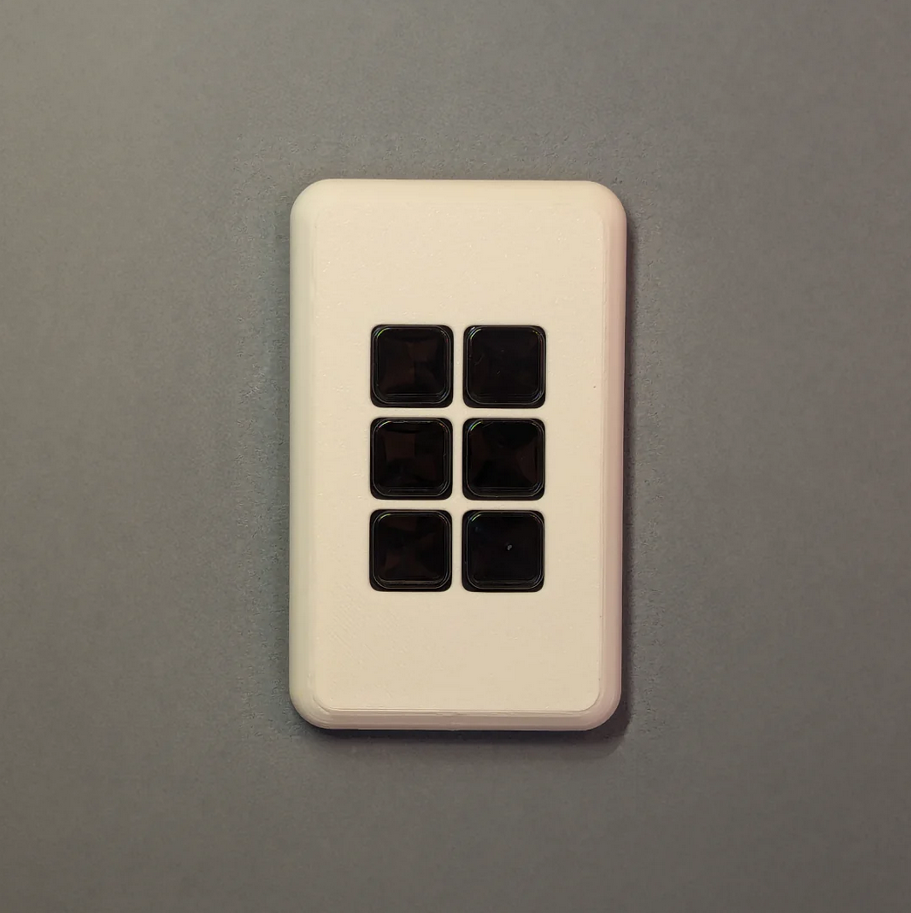
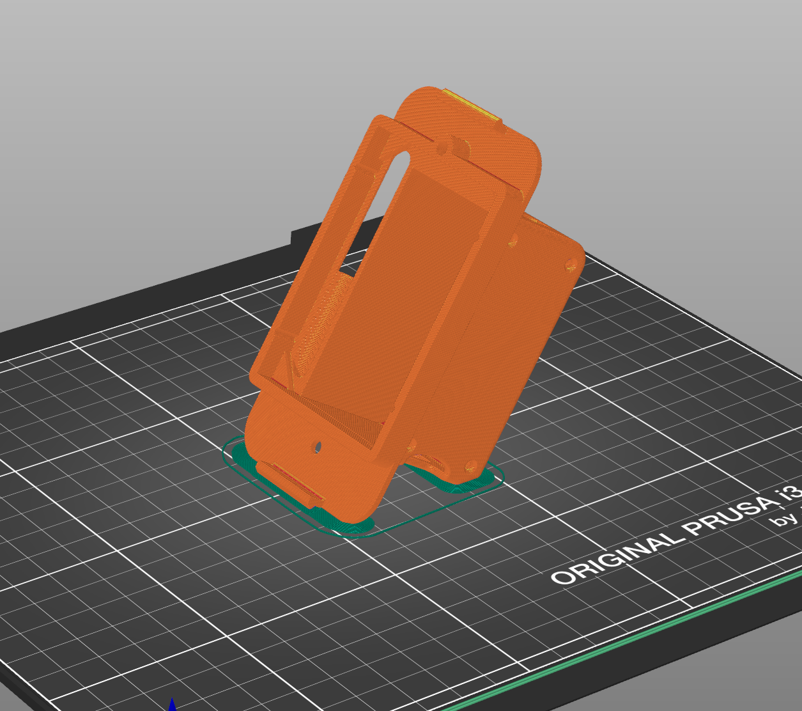
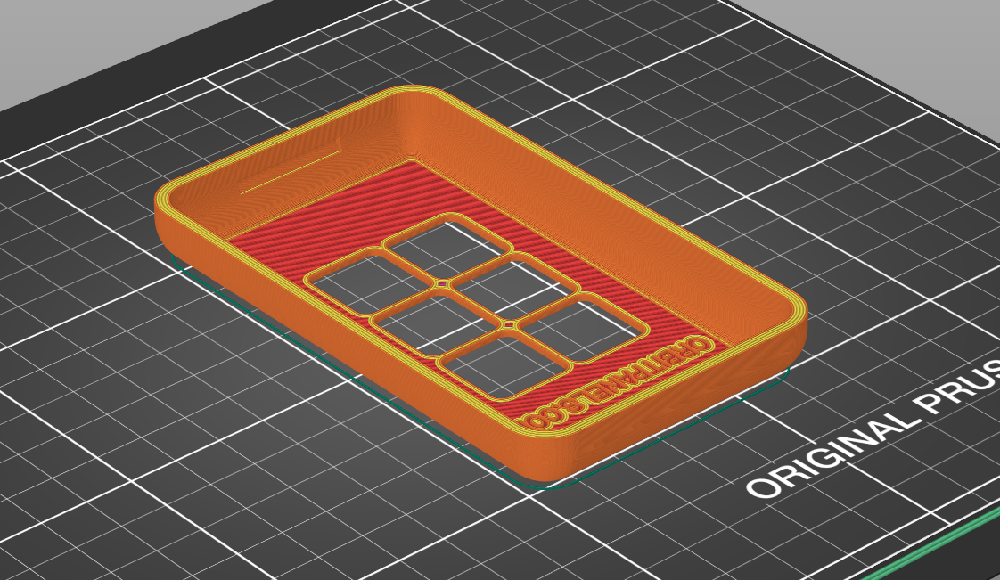
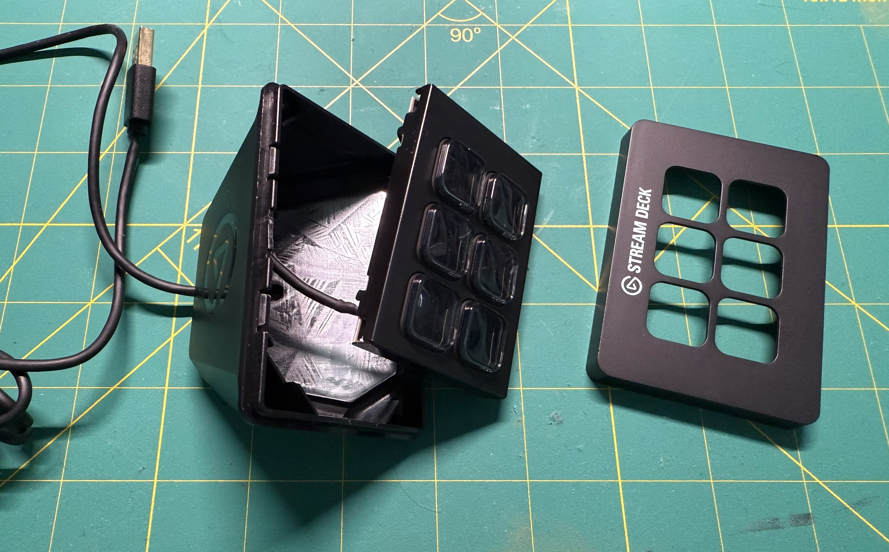
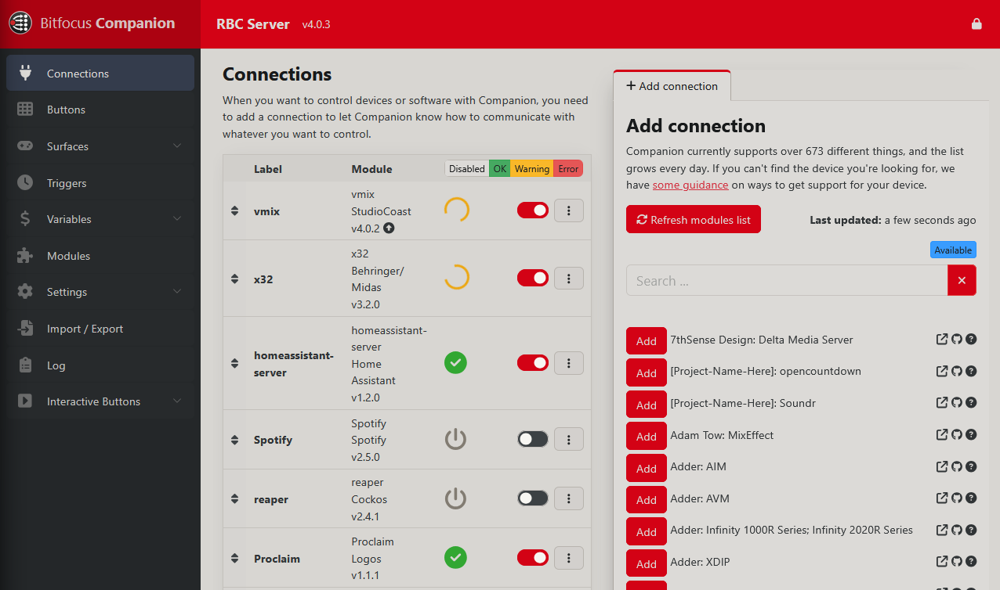
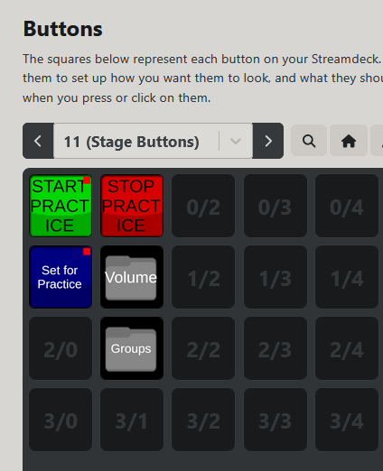
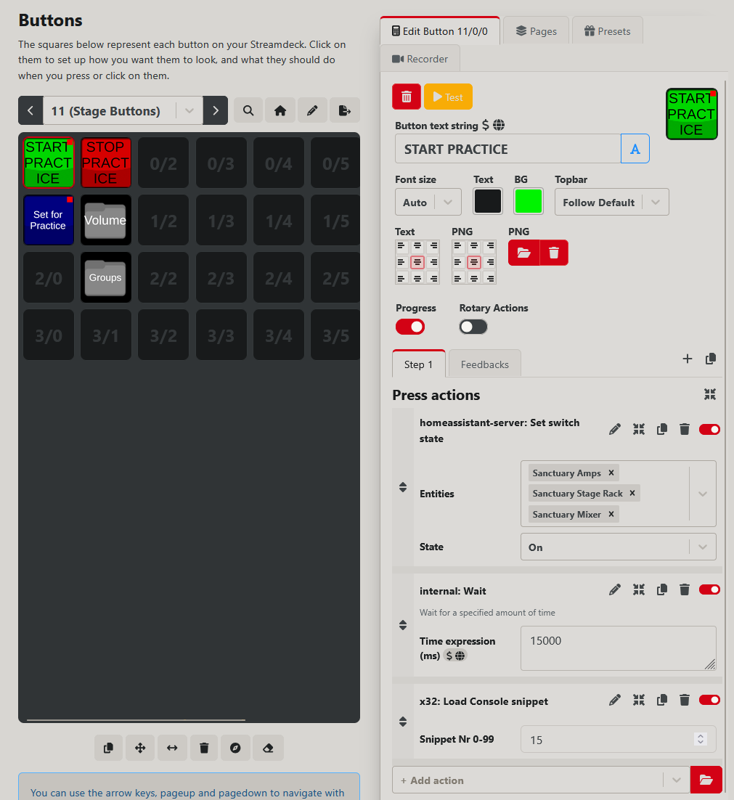
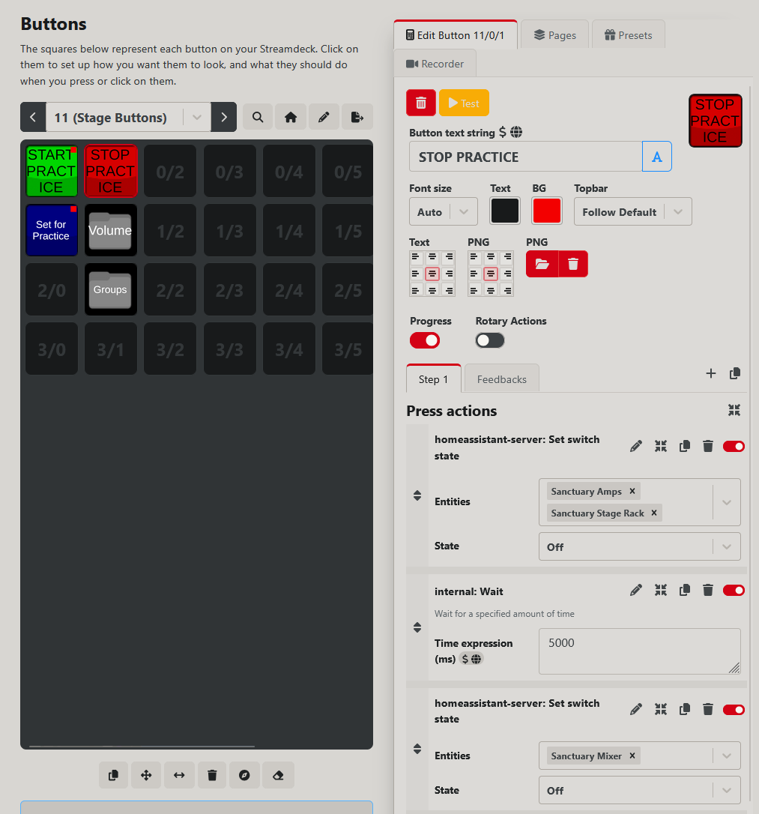
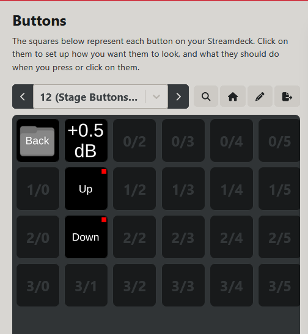

## Why?

At Ridgeview we use [Bitfocus Companion](https://bitfocus.io/companion) to control our Live Stream setup and are starting to use it for other automations. Companion can control almost anything that is computer or network based so I had an idea of putting a simple control panel on our stage to allow our band to turn on and off our sound system for rehearsals. I tried at first to use a cheap tablet with Home Assistant but using Companion and a Stream Deck allows for more flexibility and easier use. 

I found a project by [Orbit Panels](https://orbitpanels.com/products/orbit-panel-mini) that has DIY instructions to mount a 6 button Elgato Stream Deck Mini into a 1-gang wall box. This setup uses a Raspberry Pi Zero 2 and a PoE hat to give it networking and power. 

## 3D Printing the Components

The first step is to 3D print the components that Orbit provides. This includes a faceplate and a box to go inside the wall and hold the components like the Raspberry Pi, adapters, and cable. 

I printed both parts in white PLA for quick and easy printing. The faceplate I printed slow and it took about 3 hours as I wanted a nice finish on the front and sides. I printed the bracket using draft settings which makes it print a lot quicker but not look as polished at the end. This didn't matter because it's getting shoved into a wall.

I imported the models into PrusaSlicer and configured the settings. The bracket took 3 hours and 15 minutes and used 33 grams of filament at a cost of only $0.95. 

The faceplate printed at higher quality in 3 hours and 13 minutes and used 24 grams of filament at a cost of $0.69. 

3D printing is cheap but can take time to get the printer working properly and produce good prints. Thankfully I had no problems with either print.

## Modifying the Stream Deck

To fit the Stream Deck in the box, you have to pop off the front and either cut the cable or break the housing. I decided to cut the cable out and resolder a USB connector on. This has the benefit of making the cable a lot shorter and not having to hide it all in the wall.

## Putting Everything Together

## Programming in Companion

To handle this and other future controllers, I set up a new instance of Bitfocus Companion in a Debian container on our server. This lets Companion always be running independently of our streaming computer. 

Once in Companion's web config you have access to connections, which are the different things Companion can talk to and control. As of writing this they have 673 different things they support. The main ones we care about is our M32 using the X32 module and their Home Assistant module. 

We can configure this really easily by specifying the IP of our M32 mixer and our Home Assistant server and giving it an API token. 

Once the connections are added we can go to the Buttons page and start adding in what we want our buttons to do.

From here I added a few buttons for starting and stopping practice as well as some other folders. The main two are the start and stop. 

We can click on a button to configure it. I set the text and color and then start adding in actions.

The first action is turning on switches through Home Assistant. We have TP Link Kasa smart outlets on a few things so we can trigger those through Home Assistant. (There is a native TP Link Companion connection now but I have not set it up yet, that is a future change.) Once that is done, we have a 15 second wait on the sound mixer to boot up and be on the network and then it loads a snippet which just opens the band's channels and sets them to a reasonable level for them to practice.

The stop practice button just shuts everything down. It turns off our amps and stage rack first, and then 5 seconds later it turns off the sound mixer.

The Volume button goes to another page to control the main volume coming from the mixer. This will let them turn the volume up or down as needed.

## Testing

## Final Installation